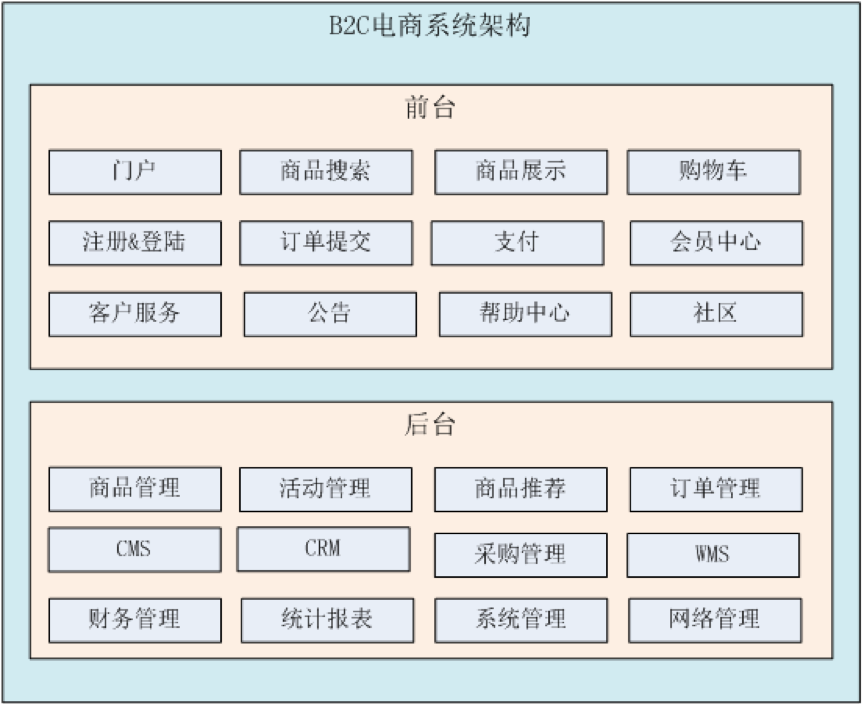
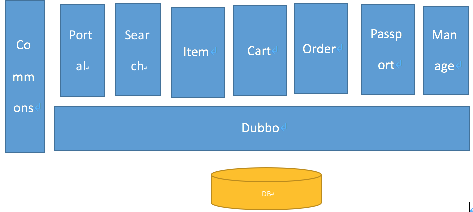

# ego

### 简介
1. 电商行业的几种模式：
    1. B2B：企业到企业，商家到商家。代表：阿里巴巴、慧聪网
    2. B2C：商家到客户。代表：京东、天猫
    3. C2C：客户到客户。淘宝集市
    4. O2O：线上到线下。美团等

2. 技术选型
    1. 后台框架：Spring、SpringMVC、Mybatis
    2. 页面：JSP、JSTL、jQuery、EasyUI、KindEditor（富文本编辑器）、CSS+DIV
    3. Redis（缓存服务器）
    4. Solr（搜索）
    5. Dubbo（调用远程服务）
    6. MySQL
    7. Nginx

3. 开发工具和环境
    1. intellij idea
    2. Maven 3.3.9
    3. Tomcat 7.0.53（Maven Tomcat Plugin）
    4. JDK 1.7
    5. Mysql 5.7
    6. Nginx 1.8.1
    7. Redis 3.0.0
    8. CentOS 6.5（服务器操作系统）

4. 系统架构

    
5. 项目基于SOA的架构

    
    

### 项目模块

* ego --父级pom项目
* ego-commons --公共方法
* ego-dubbo --dubbo provider
* ego-item --商品信息，端口：8081
* ego-manage --后台管理，端口：8080
* ego-pojo --数据库表实体类
* ego-portal --门户，端口：8082
* ego-search --搜索，端口：8083
* ego-service --dubbo服务接口
* ego-passport --sso，端口：8084

